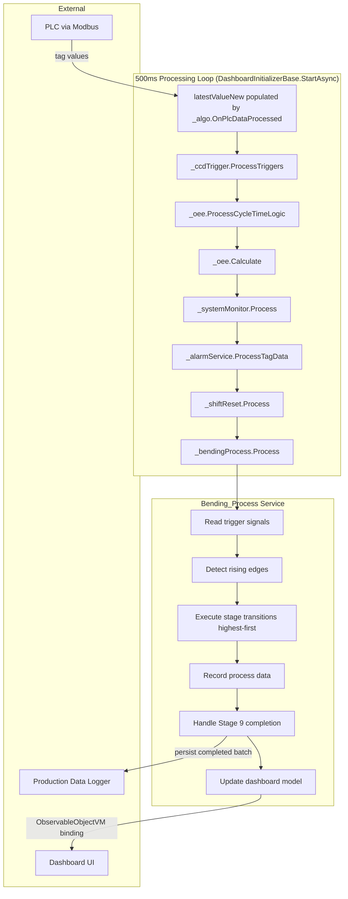
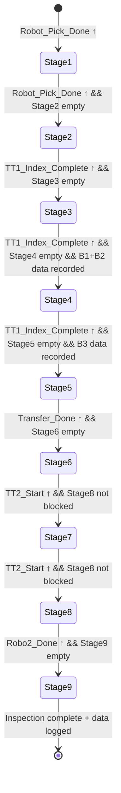

# Design Document: Bending Process FIFO

## Overview

This design describes the `Bending_Process` service — a FIFO-based batch tracking engine for a 9-stage bending machine. The service lives in `IPCSoftware.CoreService.Bending\Service\Bending_Process.cs` and is invoked every 500ms from the existing `DashboardInitializerBending` processing loop.

The service detects rising edges on PLC trigger signals read from the `latestValueNew` dictionary, manages a queue of up to 9 active batches flowing through physical stages (QR scan → TT1 bending → transfer → TT2 tearing/flipping → Robot-2 pick → inspection), records process data at each stage, and exposes batch state for dashboard display.

### Key Design Decisions

1. **Composition over inheritance** — `Bending_Process` is a standalone service injected into `DashboardInitializerBending`, not a subclass. This keeps the existing class hierarchy untouched.
2. **Single `Process()` entry point** — Called once per 500ms cycle with the current `latestValueNew` dictionary. All edge detection, transitions, and data recording happen within this call.
3. **In-memory FIFO with no persistence of queue state** — On restart the queue starts empty (per Requirement 2.6). Only completed batch data is persisted.
4. **Tag IDs via a new `BendingProcessTags` section in `TagMappingSettings`** — Follows the existing pattern of `Dashboard2`, `OEE`, etc. Placeholder tag IDs (value 0) are skipped at runtime.

## Architecture



### Integration Points

| Integration Point | Mechanism | Direction |
|---|---|---|
| PLC tag values | `latestValueNew` dictionary (Dictionary<int, object>) | Read |
| PLC write (inspection start) | `PLCClientManager.GetClient().WriteAsync()` | Write |
| Tag ID configuration | `appsettings.json` → `TagMappingSettings.BendingProcess` → `ConstantValues` | Config |
| Dashboard display | `BendingProcessDashboardModel` (ObservableObjectVM) exposed via `HandleUiRequest` | Read |
| Data persistence | `IProductionDataLogger` | Write |
| Logging | `IAppLogger` | Write |

## Components and Interfaces

### 1. `BendingProcessService` (new class)

**Location:** `IPCSoftware.CoreService.Bending\Service\Bending_Process.cs`

```csharp
public class BendingProcessService
{
    // Constructor dependencies
    public BendingProcessService(IAppLogger logger, IProductionDataLogger prodLogger);

    // Called every 500ms from DashboardInitializerBending
    public void Process(Dictionary<int, object> latestValues);

    // Expose current batch states for dashboard
    public IReadOnlyList<BatchModel> GetActiveBatches();

    // Get dashboard model (sorted descending by stage)
    public BendingProcessDashboardModel GetDashboardModel();
}
```

**Internal state:**
- `List<BatchModel> _fifoQueue` — ordered list, max 9 entries
- `Dictionary<string, bool> _previousTriggerStates` — previous cycle's trigger values for edge detection
- `int _dailyCounter` — sequential batch counter, resets daily
- `DateTime _lastCounterDate` — tracks when counter was last reset
- `Dictionary<string, int> _retryCounters` — persistence retry tracking per batch

### 2. `BatchModel` (new class)

**Location:** `IPCSoftware.Shared\Models\Bending\BatchModel.cs`

Inherits `ObservableObjectVM`. Represents a single batch of 4 parts flowing through the machine.

### 3. `BendingProcessDashboardModel` (new class)

**Location:** `IPCSoftware.Shared\Models\Bending\BendingProcessDashboardModel.cs`

Inherits `ObservableObjectVM`. Wraps the list of active batches for UI binding, sorted with Stage 9 at top.

### 4. `BendingProcessTags` (new settings class)

**Location:** Added to `IPCSoftware.Shared\Models\TagMappingSettings.cs`

Contains all PLC tag IDs for the bending process triggers and data signals.

### 5. Integration into `DashboardInitializerBending`

The `DashboardInitializerBending` constructor gains a `BendingProcessService` parameter. The `StartAsync` loop calls `_bendingProcess.Process(processedData)` after existing service calls. A new `RequestId` (e.g., 30) in `HandleUiRequest` returns the dashboard model.

## Data Models

### BatchModel

```csharp
public class BatchModel : ObservableObjectVM
{
    // Identity
    private string _batchNumber = string.Empty;
    public string BatchNumber { get => _batchNumber; set => SetProperty(ref _batchNumber, value); }

    private int _stage = 1;
    public int Stage { get => _stage; set => SetProperty(ref _stage, value); }

    // QR Codes (4 parts)
    private string _qrCode1 = string.Empty;
    private string _qrCode2 = string.Empty;
    private string _qrCode3 = string.Empty;
    private string _qrCode4 = string.Empty;
    public string QrCode1 { get => _qrCode1; set => SetProperty(ref _qrCode1, value); }
    public string QrCode2 { get => _qrCode2; set => SetProperty(ref _qrCode2, value); }
    public string QrCode3 { get => _qrCode3; set => SetProperty(ref _qrCode3, value); }
    public string QrCode4 { get => _qrCode4; set => SetProperty(ref _qrCode4, value); }

    // Bending-1 data (Stage 3): 4 Temperatures, 4 Loads
    public float[] Bending1Temperatures { get; set; } = new float[4];
    public float[] Bending1Loads { get; set; } = new float[4];

    // Bending-2 data (Stage 3): 4 Temperatures, 4 Loads
    public float[] Bending2Temperatures { get; set; } = new float[4];
    public float[] Bending2Loads { get; set; } = new float[4];

    // Bending-3 data (Stage 4): 4 Temperatures, 4 Loads, 4 X, 4 Y, 4 Z, 4 W
    public float[] Bending3Temperatures { get; set; } = new float[4];
    public float[] Bending3Loads { get; set; } = new float[4];
    public float[] Bending3X { get; set; } = new float[4];
    public float[] Bending3Y { get; set; } = new float[4];
    public float[] Bending3Z { get; set; } = new float[4];
    public float[] Bending3W { get; set; } = new float[4];

    // Tearing data (Stage 6): 4 Temperatures
    public float[] TearingTemperatures { get; set; } = new float[4];

    // Flipping data (Stage 7): 4 Forces
    public float[] FlippingForces { get; set; } = new float[4];

    // Inspection results (Stage 9): 4 booleans
    public bool[] InspectionResults { get; set; } = new bool[4];

    // Metadata
    private DateTime _createdAt;
    public DateTime CreatedAt { get => _createdAt; set => SetProperty(ref _createdAt, value); }

    private DateTime? _arrivedAtStage9;
    public DateTime? ArrivedAtStage9 { get => _arrivedAtStage9; set => SetProperty(ref _arrivedAtStage9, value); }

    private bool _inspectionComplete;
    public bool InspectionComplete { get => _inspectionComplete; set => SetProperty(ref _inspectionComplete, value); }

    private bool _dataLogged;
    public bool DataLogged { get => _dataLogged; set => SetProperty(ref _dataLogged, value); }
}
```

### BendingProcessTags (added to TagMappingSettings)

```csharp
public class BendingProcessTags
{
    // Trigger signals (boolean)
    public int RobotPickDone { get; set; }
    public int TT1IndexComplete { get; set; }
    public int TransferDone { get; set; }
    public int TransferActive { get; set; }
    public int TT2Start { get; set; }
    public int Robo2Done { get; set; }
    public int CameraInspectionComplete { get; set; }
    public int InspectionStartWrite { get; set; }  // Write tag

    // Bending completion signals
    public int CD_B1_AllDataReadComp { get; set; }
    public int CD_B2_AllDataReadComp { get; set; }
    public int CD_B3_AllDataReadComp { get; set; }
    public int TearingComplete { get; set; }
    public int FlippingComplete { get; set; }

    // QR code data tags (4 parts)
    public int QrCode1 { get; set; }
    public int QrCode2 { get; set; }
    public int QrCode3 { get; set; }
    public int QrCode4 { get; set; }

    // Bending-1 process data (4 temps, 4 loads)
    public int B1_Temp1 { get; set; }
    public int B1_Temp2 { get; set; }
    public int B1_Temp3 { get; set; }
    public int B1_Temp4 { get; set; }
    public int B1_Load1 { get; set; }
    public int B1_Load2 { get; set; }
    public int B1_Load3 { get; set; }
    public int B1_Load4 { get; set; }

    // Bending-2 process data (4 temps, 4 loads)
    public int B2_Temp1 { get; set; }
    public int B2_Temp2 { get; set; }
    public int B2_Temp3 { get; set; }
    public int B2_Temp4 { get; set; }
    public int B2_Load1 { get; set; }
    public int B2_Load2 { get; set; }
    public int B2_Load3 { get; set; }
    public int B2_Load4 { get; set; }

    // Bending-3 process data (4 temps, 4 loads, 4x, 4y, 4z, 4w)
    public int B3_Temp1 { get; set; }
    public int B3_Temp2 { get; set; }
    public int B3_Temp3 { get; set; }
    public int B3_Temp4 { get; set; }
    public int B3_Load1 { get; set; }
    public int B3_Load2 { get; set; }
    public int B3_Load3 { get; set; }
    public int B3_Load4 { get; set; }
    public int B3_X1 { get; set; }
    public int B3_X2 { get; set; }
    public int B3_X3 { get; set; }
    public int B3_X4 { get; set; }
    public int B3_Y1 { get; set; }
    public int B3_Y2 { get; set; }
    public int B3_Y3 { get; set; }
    public int B3_Y4 { get; set; }
    public int B3_Z1 { get; set; }
    public int B3_Z2 { get; set; }
    public int B3_Z3 { get; set; }
    public int B3_Z4 { get; set; }
    public int B3_W1 { get; set; }
    public int B3_W2 { get; set; }
    public int B3_W3 { get; set; }
    public int B3_W4 { get; set; }

    // Tearing data (4 temps)
    public int Tear_Temp1 { get; set; }
    public int Tear_Temp2 { get; set; }
    public int Tear_Temp3 { get; set; }
    public int Tear_Temp4 { get; set; }

    // Flipping data (4 forces)
    public int Flip_Force1 { get; set; }
    public int Flip_Force2 { get; set; }
    public int Flip_Force3 { get; set; }
    public int Flip_Force4 { get; set; }

    // Inspection results (4 parts OK/NG)
    public int InspResult1 { get; set; }
    public int InspResult2 { get; set; }
    public int InspResult3 { get; set; }
    public int InspResult4 { get; set; }
}
```

### State Machine per Batch



## Correctness Properties

*A property is a characteristic or behavior that should hold true across all valid executions of a system — essentially, a formal statement about what the system should do. Properties serve as the bridge between human-readable specifications and machine-verifiable correctness guarantees.*

### Property 1: FIFO Ordering Invariant

*For any* sequence of batch enqueue and dequeue operations on the FIFO queue, the queue SHALL preserve insertion order such that the oldest batch is always at the head and the newest batch is always at the tail.

**Validates: Requirements 1.3, 2.5**

### Property 2: Queue Capacity and Stage Uniqueness Invariant

*For any* state of the FIFO queue after any sequence of operations, the queue SHALL contain at most 9 batches AND no two batches SHALL occupy the same Stage number simultaneously.

**Validates: Requirements 1.4, 2.1**

### Property 3: Batch Creation with Validation

*For any* rising edge on `Robot_Pick_Done` with a given `latestValueNew` dictionary state, a new batch SHALL be created and enqueued at Stage 1 if and only if: (a) all 4 QR code tag values are non-empty and non-null, AND (b) the queue contains fewer than 9 batches. If either condition fails, the queue SHALL remain unchanged.

**Validates: Requirements 1.1, 1.4, 1.5**

### Property 4: Batch Number Format and Daily Reset

*For any* batch created on date D with daily sequence number N, the Batch_Number SHALL equal `BN-{D:yyyyMMdd}-{N:000}` (or more digits if N > 999). For any two batches created on different calendar days, the sequence counter SHALL have reset to 1 for the new day.

**Validates: Requirements 1.2, 1.6**

### Property 5: Stage Transition Correctness

*For any* trigger signal rising edge and any queue state, a batch at stage S SHALL advance to stage S+1 if and only if: (a) the target stage S+1 is unoccupied by another batch, AND (b) all stage-specific preconditions are met (e.g., data recording complete for Stage 3→4 and Stage 4→5). If the target stage is occupied or preconditions are not met, the batch SHALL remain at stage S and the queue SHALL be unchanged.

**Validates: Requirements 3.1, 3.2, 3.4, 3.6, 3.7, 4.1, 4.3, 6.1, 6.3**

### Property 6: TT2 Shared Signal Advancement

*For any* rising edge on `TT2_Start` and any TT2 occupancy state, IF Stage 8 is occupied by an unpicked batch THEN no TT2 batches SHALL advance; OTHERWISE all batches on TT2 SHALL advance by one position (6→7, 7→8) with the highest-stage batch processed first. Advancement SHALL occur regardless of whether process data recording has completed for the current stage.

**Validates: Requirements 5.1, 5.2, 5.6**

### Property 7: Process Data Recording

*For any* data-completion signal rising edge at the correct stage, and any set of float values in the `latestValueNew` dictionary at the configured tag IDs, the Bending_Process_Service SHALL record exactly those values into the corresponding batch fields. Specifically: Bending-1/2 data at Stage 3, Bending-3 data at Stage 4, Tearing data at Stage 6, Flipping data at Stage 7, and Inspection results at Stage 9.

**Validates: Requirements 3.3, 3.5, 5.4, 5.5, 7.1**

### Property 8: Rising Edge Detection Contract

*For any* sequence of boolean signal values across consecutive processing cycles, a stage transition SHALL fire exactly once on each false-to-true transition. A signal that is already true at service startup SHALL NOT produce a spurious edge. A signal that remains true across multiple cycles after the initial edge SHALL NOT re-trigger. An edge that fires but whose transition precondition is not met SHALL be consumed (discarded) without retry on subsequent cycles.

**Validates: Requirements 11.1, 11.2, 11.4, 11.5**

### Property 9: Dequeue on Successful Completion

*For any* batch that has completed Stage 9 (inspection results recorded and data successfully persisted), the batch SHALL be dequeued from the head of the FIFO queue. The dequeued batch SHALL always be the oldest batch in the queue.

**Validates: Requirements 2.4, 7.3**

### Property 10: Dashboard Sort Order

*For any* set of active batches in the FIFO queue, the dashboard model SHALL present batches sorted in descending Stage order (Stage 9 first, Stage 1 last).

**Validates: Requirements 8.2**

### Property 11: Safe Tag Reading with Defaults

*For any* tag ID configured in `BendingProcessTags`: if the tag ID is 0, processing for that signal SHALL be skipped; if the tag ID is non-zero but absent from `latestValueNew`, processing SHALL be skipped; if the value is present but unparseable to the expected type, the default value SHALL be used (false for booleans, 0.0f for floats).

**Validates: Requirements 10.2, 10.3, 10.4, 10.5**

### Property 12: Persistence Retry with Bounded Attempts

*For any* batch at Stage 9 with inspection complete, if persistence fails, the batch SHALL remain in the queue and retry on the next processing cycle. After 5 consecutive failures, the batch SHALL be handled (logged and removed) without blocking other operations.

**Validates: Requirements 7.4**

### Property 13: Batch Initialization Defaults

*For any* newly created batch, all numeric process data fields SHALL be initialized to 0f, all QR code fields to the scanned values (non-empty by Property 3), Stage to 1, and all inspection result fields to false.

**Validates: Requirements 9.5**

### Property 14: Stage 3→4 Data Precondition

*For any* batch at Stage 3, the batch SHALL NOT advance to Stage 4 until both `CD_B1_ALL_DATA_READ_COMP` and `CD_B2_ALL_DATA_READ_COMP` signals have been received and the corresponding Bending-1 and Bending-2 process data has been recorded, regardless of whether `TT1_Index_Complete` has fired.

**Validates: Requirements 3.8**

### Property 15: Transfer Active Blocking

*For any* queue state where `Transfer_Active` is true, no batch SHALL advance from Stage 4 to Stage 5, even if `TT1_Index_Complete` fires and Stage 5 is unoccupied.

**Validates: Requirements 4.2**

## Error Handling

| Scenario | Behavior | Severity |
|---|---|---|
| Queue full (9 batches) on Robot_Pick_Done | Reject batch, log warning | Warning |
| QR code empty/null on Robot_Pick_Done | Reject batch, log warning with position | Warning |
| Target stage occupied on transition trigger | Retain batch at current stage, log diagnostic | Diagnostic |
| Tag ID = 0 (placeholder) | Skip signal silently | None |
| Non-zero tag ID missing from latestValueNew | Skip signal, log diagnostic with tag ID and signal name | Diagnostic |
| Value unparseable to expected type | Use default (false/0.0f), continue processing | None |
| Persistence failure at Stage 9 | Retain batch, retry next cycle, max 5 attempts | Warning |
| Persistence failure after 5 retries | Log error, remove batch from queue | Error |
| Camera inspection timeout (>10s at Stage 9) | Log warning, continue waiting, don't block other transitions | Warning |
| Robo2_Done with no batch at Stage 8 | Ignore signal, log diagnostic | Diagnostic |
| TT2_Start with Stage 8 occupied (unpicked) | Block all TT2 advancement, log warning | Warning |
| Transfer_Done with Stage 6 occupied | Block transfer, log warning | Warning |

### Logging Strategy

- **Diagnostic** level: Missing tags, ignored signals, edge events with unmet preconditions
- **Warning** level: Queue full, QR validation failures, blocked transitions, persistence retries, inspection timeouts
- **Error** level: Persistence failure after max retries

All log messages include the batch number (if applicable), signal name, and current queue state summary.

## Testing Strategy

### Property-Based Testing

**Library:** [FsCheck](https://fscheck.github.io/FsCheck/) for .NET (C# integration via `FsCheck.Xunit`)

**Configuration:**
- Minimum 100 iterations per property test
- Each test tagged with: `Feature: bending-process-fifo, Property {N}: {title}`

**Generators needed:**
- `Arbitrary<BatchModel>` — random batch with valid QR codes and random process data
- `Arbitrary<List<BatchModel>>` — random queue states (0-9 batches at distinct stages)
- `Arbitrary<Dictionary<int, object>>` — random `latestValueNew` dictionaries with configured tag IDs
- `Arbitrary<bool[]>` — random trigger signal sequences for edge detection testing

**Properties to implement:**
Each of the 15 correctness properties above maps to a single property-based test.

### Unit Tests (Example-Based)

- Service startup initializes empty queue (Req 2.6)
- Batch model field types and constraints (Req 9.1)
- PLC write on Stage 9 arrival (Req 6.4)
- Dashboard model returns empty when queue empty (Req 8.5)
- Counter overflow beyond 999 (Req 1.6)
- Specific multi-transition scenario with known queue state (Req 2.3)

### Integration Tests

- Persistence round-trip with `IProductionDataLogger` mock (Req 7.2)
- Inspection timeout behavior over simulated time (Req 7.5)
- Full lifecycle: batch creation → all 9 stages → dequeue (end-to-end)
- DI registration and service resolution in `Program.cs`

### Test Organization

```
IPCSoftware.Tests/
├── BendingProcess/
│   ├── Properties/
│   │   ├── FifoOrderingTests.cs
│   │   ├── QueueInvariantTests.cs
│   │   ├── BatchCreationTests.cs
│   │   ├── StageTransitionTests.cs
│   │   ├── TT2SharedSignalTests.cs
│   │   ├── DataRecordingTests.cs
│   │   ├── EdgeDetectionTests.cs
│   │   ├── DashboardSortTests.cs
│   │   ├── TagReadingTests.cs
│   │   └── PersistenceRetryTests.cs
│   ├── Unit/
│   │   ├── BatchModelTests.cs
│   │   ├── BatchNumberFormatTests.cs
│   │   └── ServiceStartupTests.cs
│   └── Integration/
│       ├── FullLifecycleTests.cs
│       └── PersistenceTests.cs
```

